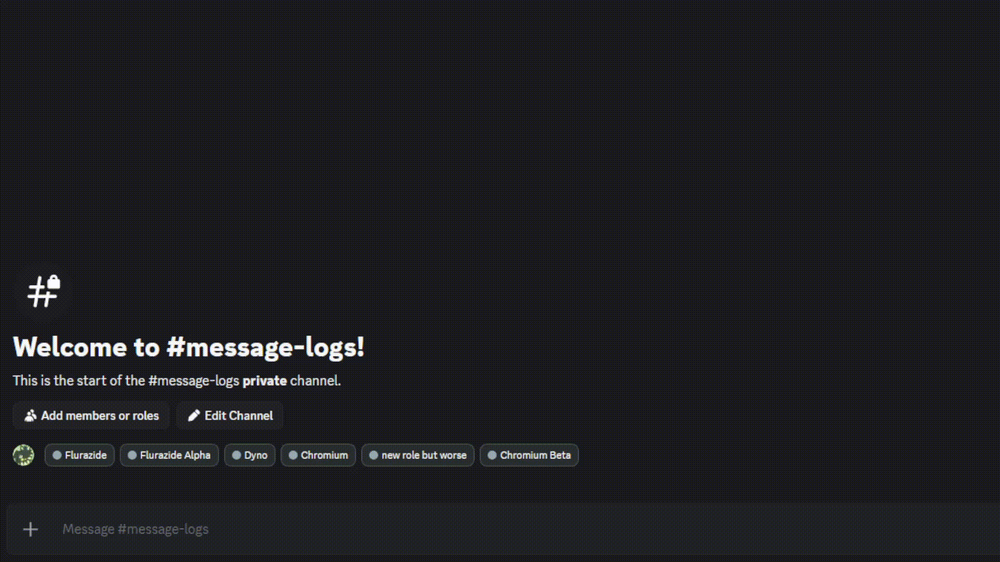
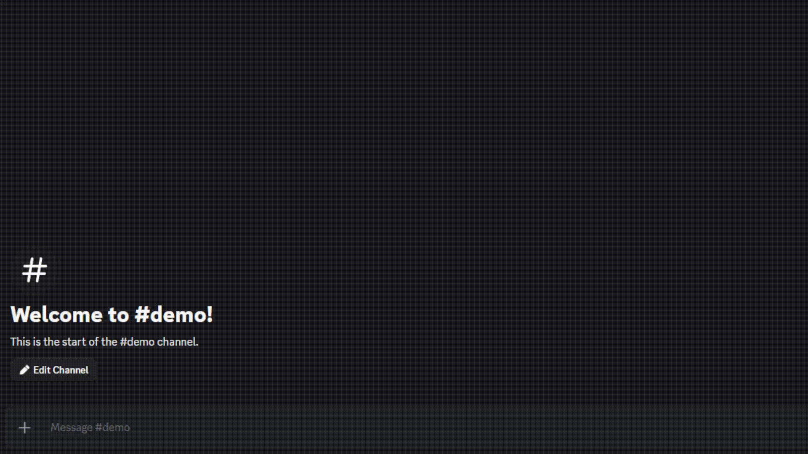

# Chromium

[![Build Status][shield-build]][shield-build-url]
[![License][shield-license]][shield-license-url]
[![Python Version][shield-python]][shield-python-url]
[![Platform][shield-discord]][shield-discord-url]

> **Discord.py oriented platform for general server logging**

Chromium is a robust, production-ready Discord bot designed for comprehensive server logging and moderation auditing. Built with `discord.py` 2.0+, it emphasizes modularity, security, and scalability. Features include per-guild isolated logging configurations, intelligent log rotation, suspicious activity heuristics, and seamless Google Drive integration for data redundancy.

---

## Table of Contents

- [About](#about)
- [Features](#features)
- [Screenshots](#screenshots)
- [Installation](#installation)
- [Usage](#usage)
- [Configuration](#configuration)
- [Project Structure](#project-structure)
- [Roadmap](#roadmap)
- [Contributing](#contributing)
- [License](#license)
- [Contact](#contact)

---

## About

Chromium exists to fill the gap for a reliable, self-hosted logging solution that respects data privacy and server specific needs. Unlike generic bots, Chromium offers granular control over what is logged, ensuring that server administrators have the exact data they need for auditing without the noise.

**Core Goals:**
*   **Reliability:** Ensure no critical event is missed.
*   **Privacy:** Keep logs isolated per guild and rotated to minimize data hoarding.
*   **Scalability:** Built on `AutoShardedBot` to handle growth effortlessly.

## Features

### Core Logging
*   **Modular Architecture**: Enable or disable specific logging modules (Message, Voice, Member, Role, Channel, etc.) on a per-guild basis.
*   **Audit Log Lookups**: Automatically correlates events with audit log entries for richer context.
*   **Database Rotation**: Automatically prunes logs exceeding the 50-entry limit per guild (ON EXPORT) to maintain database performance and reduce storage footprint.

### Security & Integrity
*   **Suspicious Activity Heuristics**: Algorithms to detect and flag potential raids, nuke attempts, or anomalous user behavior (e.g., mass deletions, rapid role changes).
*   **Per-Guild Isolation**: Strict data boundaries ensure configuration and logs never leak between servers.

### Integration & Deployment
*   **Google Drive Backups**: Optional integration to automatically upload database backups and log exports to Google Drive.
*   **Docker Ready**: tailored `Dockerfile` for easy containerized deployment.
*   **Sharding Support**: Native support for Discord sharding.

## Demos





## Installation

### Prerequisites
*   Python 3.11 or higher
*   A Discord Bot Token (with Message Content, Server Members, and Presence Intents enabled)
*   (Optional) Google Cloud Service Account credentials for Drive integration

### Local Setup

1.  **Clone the repository**
    ```bash
    git clone https://github.com/ThatOneFBIAgent/Chromium.git
    cd Chromium
    ```

2.  **Install dependencies**
    ```bash
    pip install -r requirements.txt
    ```

3.  **Configure Environment**
    Create a `.env` file in the root directory (see [Configuration](#configuration) below).

4.  **Run the bot**
    ```bash
    python bot.py
    ```

### Docker Setup

1.  **Build the image**
    ```bash
    docker build -t chromium-bot .
    ```

2.  **Run the container**
    ```bash
    docker run -d \
      --name chromium \
      --env-file .env \
      -v $(pwd)/data:/app/data \
      --restart unless-stopped \
      chromium-bot
    ```

## Usage

### Basic Commands
Chromium uses Slash Commands for all interactions.

-   `/setup` - Initialize the bot for your server.
-   `/log <module> <channel>` - Configure a logging module to a specific channel.
-   `/export` - Export logs to a JSON file for safekeeping.

### Configuration Example
To set up message logging:
1.  Run `/setup` to initialize the database for your guild.
2.  Create a channel `#server-logs`.
3.  Run `/log message #server-logs`.

## Configuration

Environment variables are managed via a `.env` file. Copy `.env.example` as a template.

| Variable | Description | Required |
| :--- | :--- | :--- |
| `DISCORD_TOKEN` | Your Discord Bot Token. | Yes |
| `BETA_TOKEN` | Alternate token for dev/beta instances. | No |
| `DRIVE_CREDS_B64` | Base64 encoded Google Service Account JSON. | No |
| `DRIVE_FOLDER_ID`| ID of the Google Drive folder for backups. | No |
| `SHARD_COUNT` | Force specific shard count (Default: Auto). | No |

## Project Structure

```bash
Chromium/
├── bot.py                  # Application entry point
├── config.py               # Configuration loader
├── Dockerfile              # Container definition
├── requirements.txt        # Python dependencies
├── commands/               # Slash command cog implementations
├── database/               # SQLite database wrapper & migration logic
├── logging_modules/        # Individual event logging logic (Modular)
├── services/               # Background services (Backup, cleanup)
└── utils/                  # Helper utilities (Drive, Embeds, RateLimit)
```

## Roadmap

- [ ] **Web Dashboard**: A frontend for easier log viewing and configuration.
- [ ] **Advanced Analytics**: Visual graphs for server activity.
- [ ] **Multi-Language Support**: Localization for response messages.
- [ ] **Plugin System**: API for community-created logging modules.

## Contributing

Contributions are welcome! Please follow these steps:

1.  Fork the repository.
2.  Create a feature branch (`git checkout -b feature/AmazingFeature`).
3.  Commit your changes (`git commit -m 'Add some AmazingFeature'`).
4.  Push to the branch (`git push origin feature/AmazingFeature`).
5.  Open a Pull Request.

Please ensure your code follows the existing style conventions (PEP 8) and passes any included tests.

## Testing

To run the test suite (if applicable):

```bash
pytest
```

## License

Distributed under the **AGPLv3** License. See `LICENSE` for more information.

## Contact

*   **Issues**: [GitHub Issues](https://github.com/ThatOneFBIAgent/Chromium/issues)
*   **Discord**: `_izacarlos`

---

<!-- Badges References -->
[shield-build]: https://img.shields.io/badge/build-passing-brightgreen?style=flat-square
[shield-build-url]: #
[shield-license]: https://img.shields.io/badge/license-AGPLv3-blue?style=flat-square
[shield-license-url]: LICENSE
[shield-python]: https://img.shields.io/badge/python-3.11+-blue?style=flat-square&logo=python&logoColor=white
[shield-python-url]: https://www.python.org/downloads/
[shield-discord]: https://img.shields.io/badge/discord-active-7289DA?style=flat-square&logo=discord&logoColor=white
[shield-discord-url]: https://discord.com